<div align="center">

# ClayHabbit

**Your habits, tasks, notes, calendar, focus and money, in one calm place.**
On your Android phone and on the web, encrypted, and kept in your own Google Drive.

> ### :: APPLICATION COMPLETED ABOUT TO DEPLOY STAY TUNED ::

[**Website**](https://clay-habbit.vercel.app) ·
[**Web app**](https://clay-habbit.vercel.app/sign-in) ·
[**Android download**](https://clay-habbit.vercel.app/download) ·
[Releases](https://github.com/Cheekurthi-Vamsi/ClayHabit/releases) ·
[Privacy](https://clay-habbit.vercel.app/privacy) ·
[Terms](https://clay-habbit.vercel.app/terms)

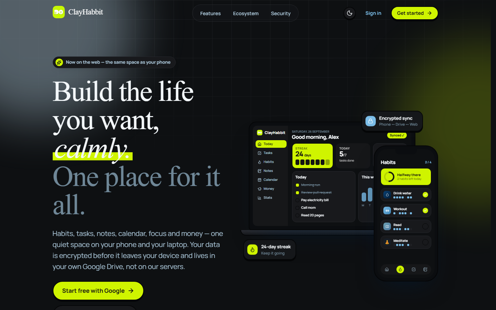

</div>

---

## Contents

- [Links](#links)
- [Screenshots](#screenshots)
- [What's inside](#whats-inside)
- [Privacy and security](#privacy-and-security)
- [How it's built](#how-its-built)
- [Getting started](#getting-started)
- [Scripts](#scripts)
- [Building the Android app](#building-the-android-app)
- [Building and deploying the web app](#building-and-deploying-the-web-app)
- [Releasing](#releasing)
- [Sign-in and data storage](#sign-in-and-data-storage)
- [Database](#database)
- [Design system](#design-system)

## Links

| | |
| --- | --- |
| Website (landing) | https://clay-habbit.vercel.app |
| Web app (sign in) | https://clay-habbit.vercel.app/sign-in |
| Android app (APK download and install steps) | https://clay-habbit.vercel.app/download |
| Android releases | https://github.com/Cheekurthi-Vamsi/ClayHabit/releases |
| Privacy policy | https://clay-habbit.vercel.app/privacy |
| Terms of use | https://clay-habbit.vercel.app/terms |

## Screenshots

### Web

| Welcome | Sign in |
| :---: | :---: |
| 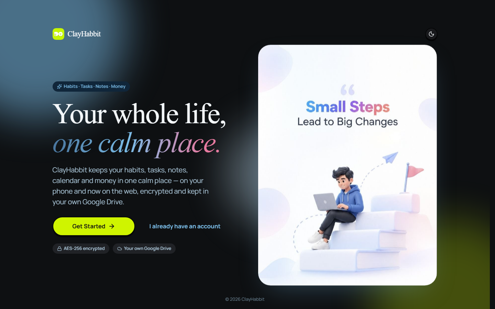 | 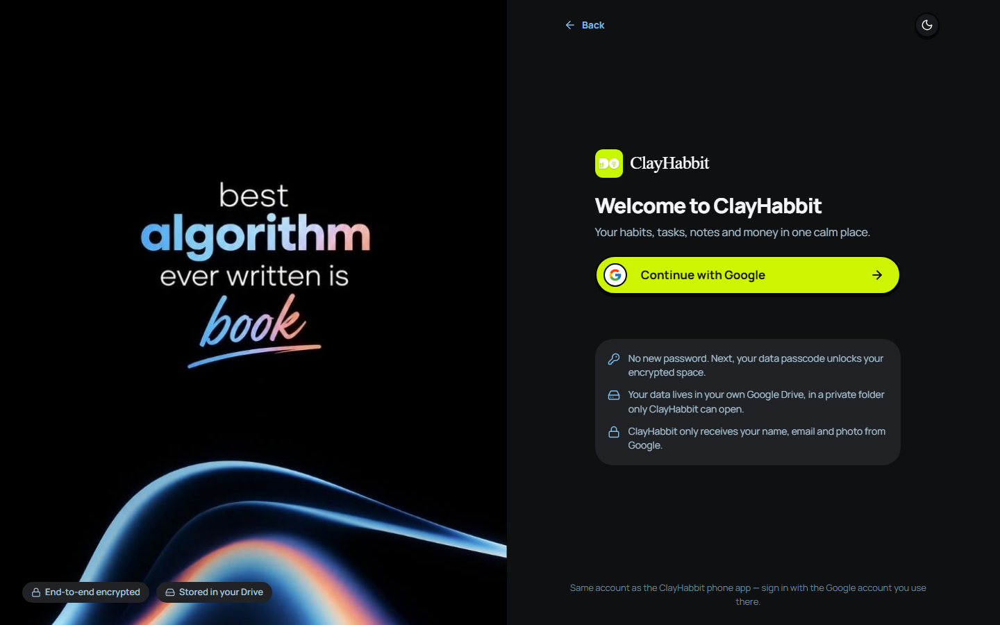 |

| Landing, light theme | Landing on a phone |
| :---: | :---: |
| 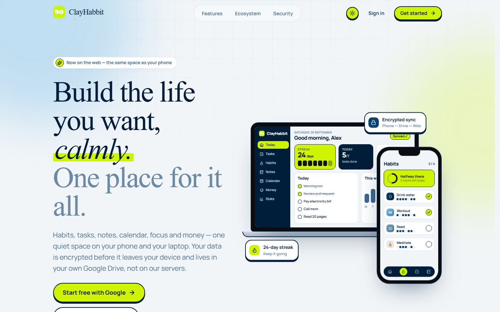 | 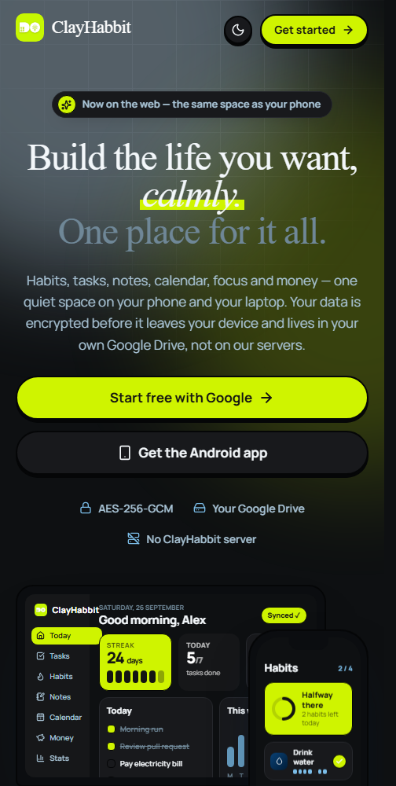 |

**Features**, built from the app's real components: the habit heatmap, tasks, notes, calendar, focus and money.

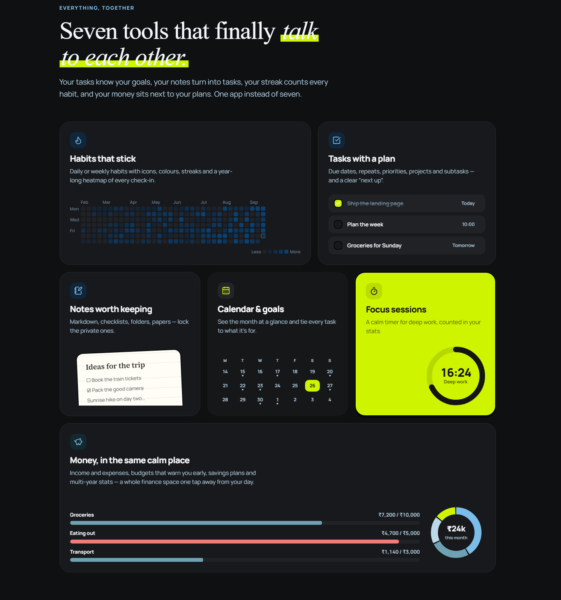

**Ecosystem:** phone ↔ your Google Drive ↔ web, sealed end to end.

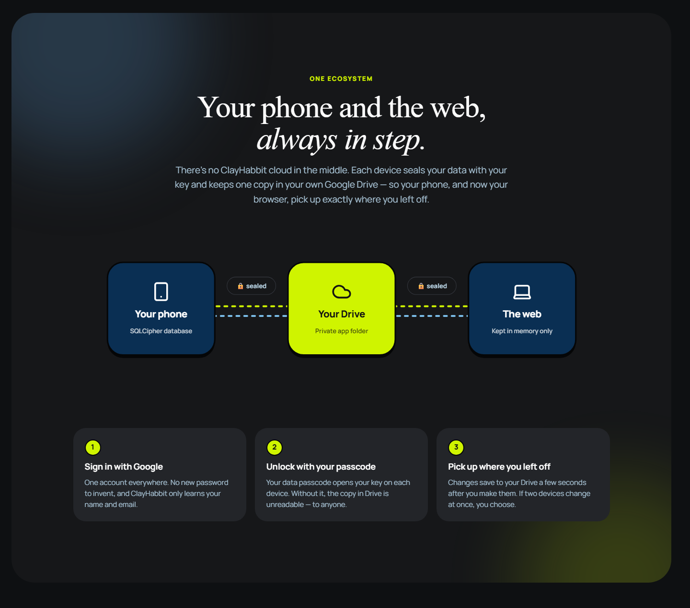

**Security:** what protects your data, and what ClayHabbit never does.

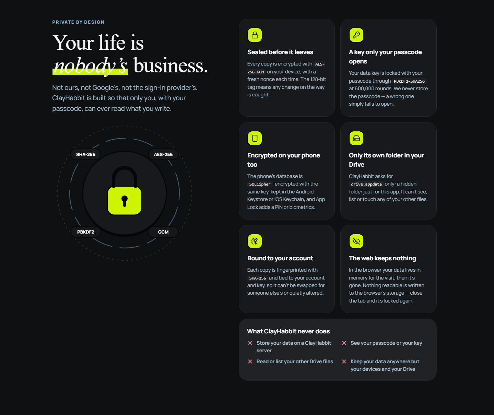

| Android download page | Call to action |
| :---: | :---: |
| 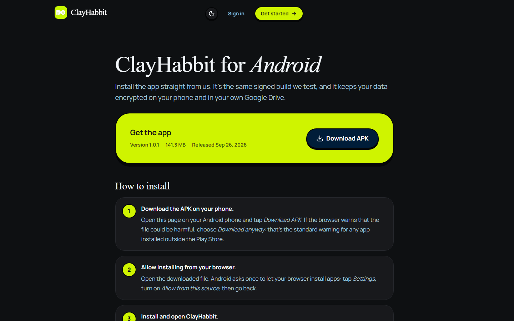 | 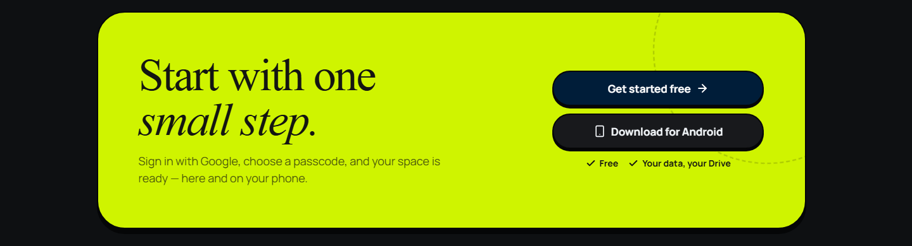 |

### Android app

| Sign in | Today | Notes | Money | Stats |
| :---: | :---: | :---: | :---: | :---: |
| 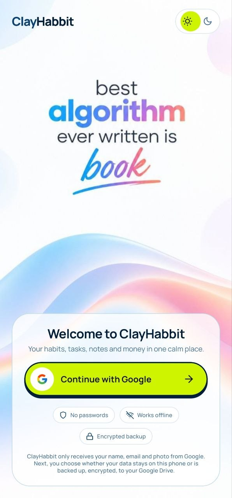 | 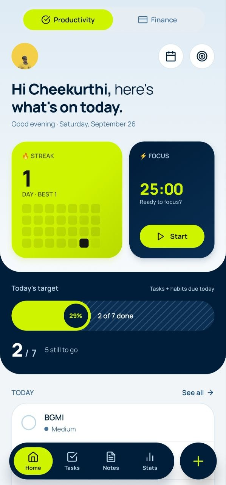 | 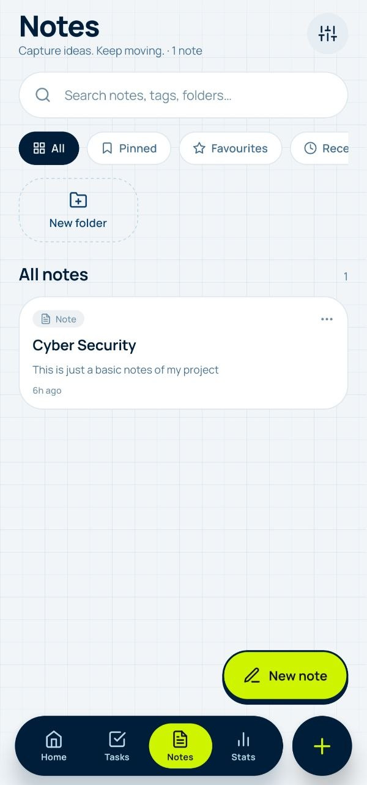 | 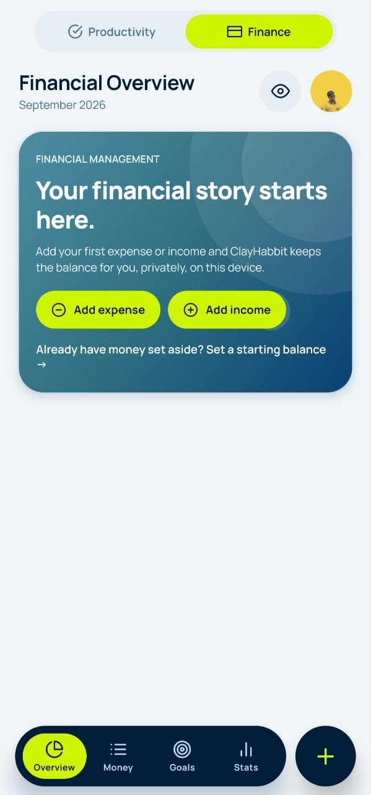 | 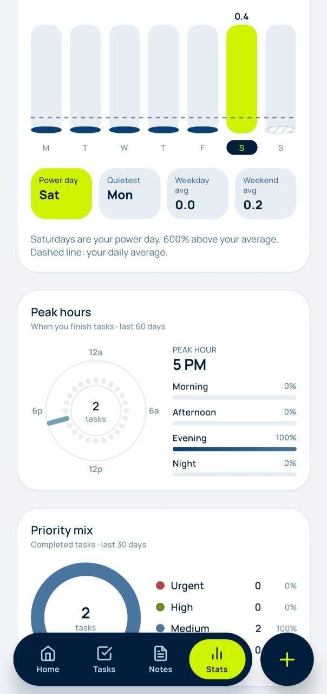 |

## What's inside

| | |
| --- | --- |
| **Today** | A dashboard with a streak card (4-week grid), focus card, today's target, week columns, next up, tasks, habits, latest note, the year's activity heatmap, and money and focus at a glance |
| **Tasks** | Due dates and times, repeats, priorities, projects, goals, subtasks and reminders |
| **Habits** | Daily or weekly habits with a bundled icon set (line and colour), streaks, completion rates and heatmaps |
| **Notes** | Markdown notes with checklists, folders, colours, papers, pins, favourites, locked notes and trash |
| **Calendar and goals** | Month view with events and due tasks; goals with progress from their linked tasks |
| **Focus** | A focus timer whose sessions count toward your stats |
| **Money** | Income and expenses, categories, budgets, savings plans and multi-year stats |
| **Stats** | Streaks, a yearly heatmap, weekly rhythm, time of day and priorities |
| **Sync** | Phone ↔ Google Drive ↔ web. Saves about a second after each change; the other side picks it up within seconds |

## Privacy and security

- **No ClayHabbit server.** Your data lives on your devices and, if you turn on Cloud, in your own Google Drive.
- **Encrypted before it leaves the device:** AES-256-GCM with a fresh nonce per save, and SHA-256 fingerprints bound to your account and key.
- **Your passcode is the key.** The data key is locked with your passcode (PBKDF2-SHA256, 600,000 rounds). The passcode is never stored or sent, so nobody else can open your data, us included.
- **Encrypted on the phone:** the database is SQLCipher, and its key is protected by the Android Keystore. App Lock adds a PIN or biometrics.
- **Only its own Drive folder:** the `drive.appdata` scope. ClayHabbit can't see any of your other files.
- **The web keeps nothing.** In the browser, your data lives in the tab's memory only and is gone when you close it.
- **No ads, analytics or tracking.**

## How it's built

One repository, two apps that share the same logic:

```
src/            The Android app (Expo SDK 57, Expo Router, TypeScript)
  app/            Routes (thin — screens import from features/)
  features/       Screens and hooks by domain (tasks, habits, notes, finance, cloud, vault, …)
  components/ui/  The design system (Button, Card, Heatmap, charts, …)
  data/           SQLite migrations and repositories (the only layer that touches SQL)
  domain/         Entities and pure services (recurrence, streaks, heatmaps, finance)
  lib/            Crypto, Drive sync, vault, notifications, updates
  theme/          Design tokens: colours, type, spacing, radii
web/            The web app (Vite, React, TypeScript): landing and the signed-in app
  src/shims/      Browser versions of the three native modules the shared code uses
modules/        A local Expo module: native PBKDF2 (Android and iOS)
docs/           Publishing guide and screenshots
```

- **The web app reuses the phone's code.** Vite aliases import `src/data`, `src/domain`, the feature hooks, and the crypto and sync engine straight from `../src`. They swap `expo-sqlite`, notifications and native PBKDF2 for browser versions: `@sqlite.org/sqlite-wasm` in memory, and WebCrypto.
- **One design system.** The web's colours, radii, spacing and type are generated from `src/theme` at build time, so the two apps can't drift apart.

**Stack:** Expo SDK 57 · Expo Router · TypeScript (strict) · SQLite (expo-sqlite with SQLCipher / sqlite-wasm) · TanStack Query · Zustand · Reanimated · Clerk (Google sign-in) · Google Drive API · Vite · React 19 · Jest and Vitest.

## Getting started

**Requirements:** Node.js 20+ (24 recommended), npm. For the Android app you also need Android Studio (SDK and NDK) and JDK 21.

```bash
git clone https://github.com/Cheekurthi-Vamsi/ClayHabit.git
cd ClayHabit
npm install              # the phone app
cd web && npm install    # the web app
```

**Environment.** Env files are never committed. Create `.env` in the repository root:

```bash
# Clerk Dashboard → API keys → Publishable key
EXPO_PUBLIC_CLERK_PUBLISHABLE_KEY=pk_test_...
# Google Cloud Console → Credentials → Web client ID (public, not a secret)
EXPO_PUBLIC_GOOGLE_WEB_CLIENT_ID=....apps.googleusercontent.com
```

Both apps read it: Expo directly, and the web through Vite's `envDir`. Without the keys the phone app runs local-only.

**Run the Android app** on a device or emulator (it's a development build, since Google sign-in needs native code, so Expo Go won't do):

```bash
npm run android
```

**Run the web app** at http://localhost:5173:

```bash
cd web
npm run dev
```

## Scripts

**Phone app** (repository root)

| Command | What it does |
| --- | --- |
| `npm start` | Start the Metro dev server |
| `npm run android` | Build the debug app and run it on a device or emulator |
| `npm run android:prebuild` | Delete and regenerate `android/` from the config |
| `npm run android:apk` | Standalone release APK |
| `npm run android:aab` | Play Store bundle |
| `npm run release:android -- patch` | New release: bump the version, build the signed APK, write notes and checksum ([Releasing](#releasing)) |
| `npm test` · `npm run typecheck` · `npm run lint` · `npm run format` | Jest · `tsc --noEmit` · ESLint · Prettier |

**Web app** (`web/`)

| Command | What it does |
| --- | --- |
| `npm run dev` | Dev server at http://localhost:5173 |
| `npm run build` | Typecheck and production build in `web/dist` |
| `npm run build:deploy` | Production build only (what Vercel runs) |
| `npm run preview` | Serve the production build locally |
| `npm test` | Vitest: the in-browser database and phone ↔ web sync |
| `npm run typecheck` | `tsc --noEmit` |

## Building the Android app

`android/` is generated from `app.json`, `app.config.ts` and `plugins/with-android-build.js`, and it's git-ignored. Don't edit it by hand: change the config and regenerate.

**Prerequisites:**
- Android Studio (SDK and NDK), with `ANDROID_HOME` set to the SDK.
- JDK 21 (Android Studio → Settings → Build Tools → Gradle → Download JDK → JetBrains Runtime 21). Newer JDKs break this build, so the Gradle daemon is pinned to 21 by `android/gradle/gradle-daemon-jvm.properties`.

| Command | Output |
| --- | --- |
| `npm run android:apk` | `android/app/build/outputs/apk/release/app-release.apk` |
| `npm run android:aab` | `android/app/build/outputs/bundle/release/app-release.aab` |

**Android Studio:** open the `android/` folder, not the repository root. Debug builds need Metro running (`npx expo start`). For a standalone build, switch Build Variants to `release`, then use Build → Generate App Bundles or APKs.

**Release signing:** release builds use the debug key unless an upload key is set in `~/.gradle/gradle.properties`. That file is outside the repo, so the setting survives regeneration:

```properties
CLAYHABIT_UPLOAD_STORE_FILE=C:/keys/clayhabit-upload.keystore
CLAYHABIT_UPLOAD_KEY_ALIAS=clayhabit
CLAYHABIT_UPLOAD_STORE_PASSWORD=...
CLAYHABIT_UPLOAD_KEY_PASSWORD=...
```

Create the key with `keytool -genkeypair -v -keystore clayhabit-upload.keystore -alias clayhabit -keyalg RSA -keysize 2048 -validity 10000`.

**Back it up.** Android only installs an update over an app signed with the same key, and Google sign-in matches the key's SHA-1. So register that SHA-1 on the Android OAuth client in Google Cloud.

**Permissions:**
- `android.blockedPermissions` in `app.json` removes permissions that libraries add but ClayHabbit never uses.
- `expo.autolinking.android.exclude` in `package.json` keeps Clerk's unused Solana module out of the APK.

## Building and deploying the web app

The website is hosted on **Vercel** and redeploys on every push to `main`.

- `vercel.json` (repository root) and `web/vercel.json` both build `web/` and serve `web/dist`, so the Vercel project works with its Root Directory set to either.
- Set `EXPO_PUBLIC_CLERK_PUBLISHABLE_KEY` and `EXPO_PUBLIC_GOOGLE_WEB_CLIENT_ID` in Vercel → Settings → Environment Variables. They're built in at build time, so redeploy after changing them.
- In Google Cloud, add the site's address to the web client's **Authorized JavaScript origins**.

Step by step, including the Google consent screen and Clerk production, is in [`docs/PUBLISHING.md`](docs/PUBLISHING.md).

## Releasing

The Android app is distributed from GitHub Releases, not the Play Store:

```bash
npm run release:android -- patch     # or: minor · major · 1.2.0
```

This bumps the version (and `versionCode`), builds the signed APK, and puts `release/ClayHabbit.apk` in place, with release notes and the SHA-256 checksum. Then create a GitHub release with the printed tag and attach `ClayHabbit.apk` under that exact name. After that:
- the website's **Download APK** button serves the new version;
- installed apps offer the update within a day, or at once from Settings → About → **Check for updates**.

## Sign-in and data storage

- **Sign-in is Google only**, through Clerk: there are no ClayHabbit passwords. On the phone, the native Google account sheet's ID token goes to Clerk. On the web, it's Clerk's Google redirect.
- **A data passcode** (8+ characters, letters and numbers) locks a random 256-bit data key: PBKDF2-SHA256, 600,000 rounds, sealed with AES-256-GCM. The passcode is never stored.
  - **Phone:** the key encrypts the SQLCipher database, and the unlocked key is cached in the Keystore.
  - **Cloud (optional):** the locked key and an AES-256-GCM encrypted snapshot of the database live in Drive's hidden app folder (`drive.appdata`). A new phone or the web unlocks them with the passcode.
  - **Web:** after the passcode, the snapshot is restored into an in-memory database; edits are sealed and saved back within about a second.
- **Conflicts:** when both sides changed at once, the person picks which copy to keep.

**One-time setup:**
- **Google Cloud Console:**
  - turn on the **Google Drive API**;
  - fill in the consent screen (home page, privacy, terms) and publish it;
  - add the `drive.appdata` scope;
  - create a **Web** client (its ID goes in `.env`, and the site goes in its JavaScript origins);
  - create an **Android** client (package `com.kernalpanic.clayhabit` + the SHA-1 of the signing key).
- **Clerk Dashboard:**
  - Google SSO with **custom credentials** (the web client's ID and secret);
  - make the other sign-up fields optional;
  - allowlist `clayhabit://sso-callback`.

## Database

The schema evolves through numbered migrations in `src/data/db/migrations/`, applied in order and tracked with SQLite's `PRAGMA user_version` (`src/data/db/migrate.ts`). The phone and the web run the same migrations. Add a new migration rather than editing one that has shipped.

## Design system

- **Phone:** `/dev/ui-showcase` (Settings → Developer, in dev builds) shows every component in the shared design system.
- **Web:** the same tokens come from `src/theme` as CSS variables.

---

<div align="center">

**:: APPLICATION COMPLETED ABOUT TO DEPLOY STAY TUNED ::**

Made with care by [Cheekurthi-Vamsi](https://github.com/Cheekurthi-Vamsi) · Small steps, big changes.

</div>
