

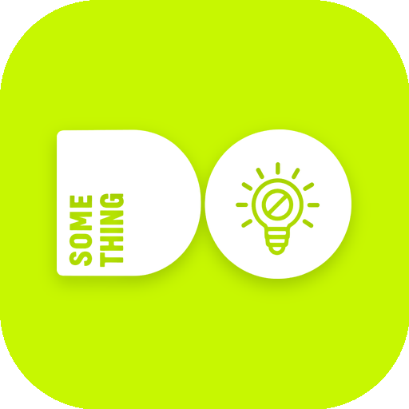

# ClayHabbit

**Your habits, tasks, notes, calendar, focus and money, in one calm place.**
On your Android phone and on the web, encrypted, and kept in your own Google Drive.

[**Website**](https://clay-habbit.vercel.app) ·
[**Web app**](https://clay-habbit.vercel.app/sign-in) ·
[**Android download**](https://clay-habbit.vercel.app/download) ·
[Releases](https://github.com/Cheekurthi-Vamsi/ClayHabit/releases) ·
[Privacy](https://clay-habbit.vercel.app/privacy) ·
[Terms](https://clay-habbit.vercel.app/terms)

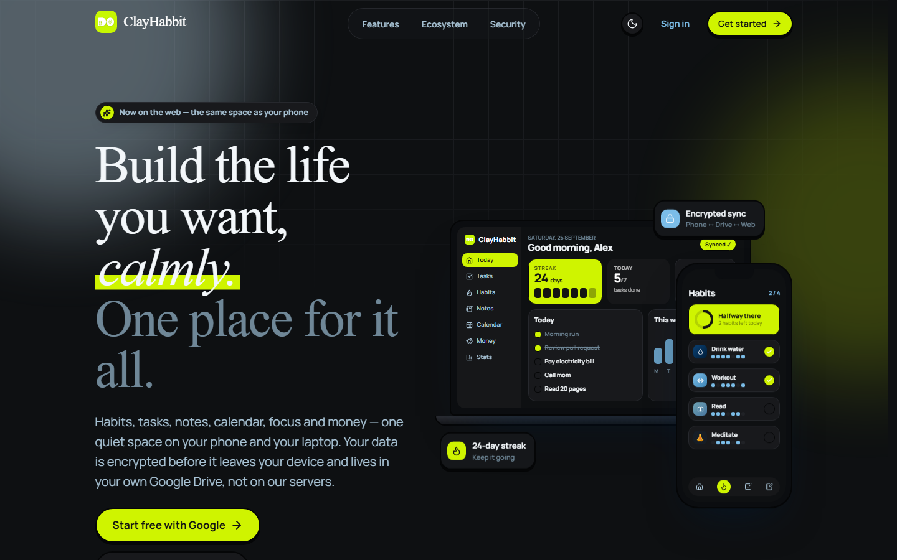

---

> This repository is the public home of ClayHabbit: screenshots, releases and links.
> The source code is private.

## New in 1.0.2

- **Draw in your notes** with a pencil, pen, brush, marker or highlighter, plus shapes (line, arrow, rectangle, circle, triangle, diamond, star), an eraser, 12 colours and 3 sizes.
- **Tables** inside notes, with their own editor for rows, columns and alignment.
- **8 fonts** per note: Clean, Serif, Elegant, Rounded, Mono, Handwriting, Marker and Typewriter.
- **Text colours**, underline, strikethrough, highlight and heading sizes.
- **Draw · Table · Font** buttons at the bottom of every note, and *Drawing* and *Table* in the Notes **+** menu.
- A cleaner app icon.

## Try it

| | |
| --- | --- |
| **Web app** | Open https://clay-habbit.vercel.app in any modern browser and sign in with Google. |
| **Android** | Download the latest [**ClayHabbit.apk**](https://github.com/Cheekurthi-Vamsi/ClayHabit/releases/latest/download/ClayHabbit.apk), open it on your phone (Android 7.0+) and allow your browser to install apps. Step-by-step guide: https://clay-habbit.vercel.app/download |
| **Updating** | Install the new APK over the old one: your data stays. The app tells you when a new version is out (Settings → About → Check for updates). |
| **Verify** | Each [release](https://github.com/Cheekurthi-Vamsi/ClayHabit/releases) lists the APK's SHA-256. Every version is signed with the same ClayHabbit release key (certificate SHA-1 `FA:22:5F:0F:D4:4D:47:90:BF:92:9E:09:23:A7:C7:C5:38:0B:F1:E1`). |

## Screenshots

### Android app

| Sign in | Today | Notes | Money | Stats |
| :---: | :---: | :---: | :---: | :---: |
| 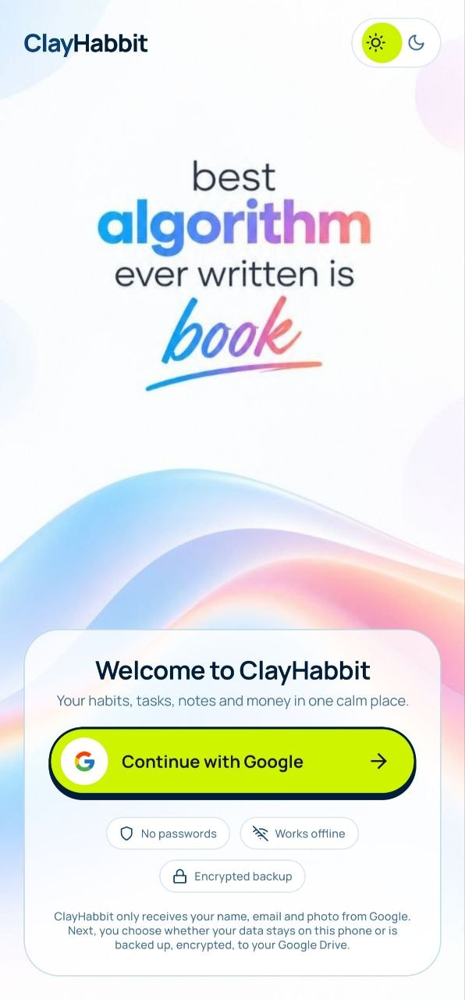 | 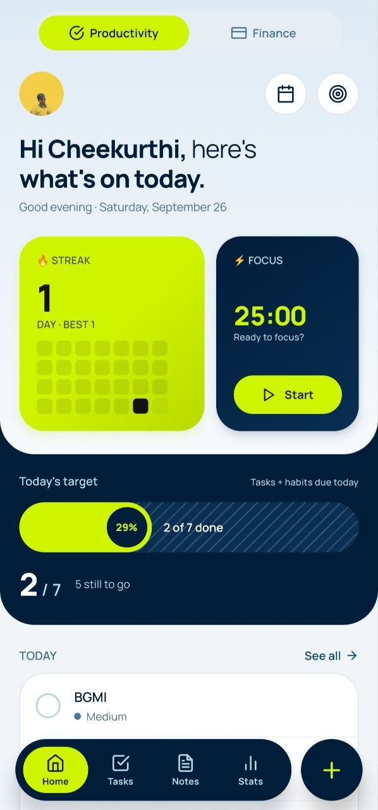 | 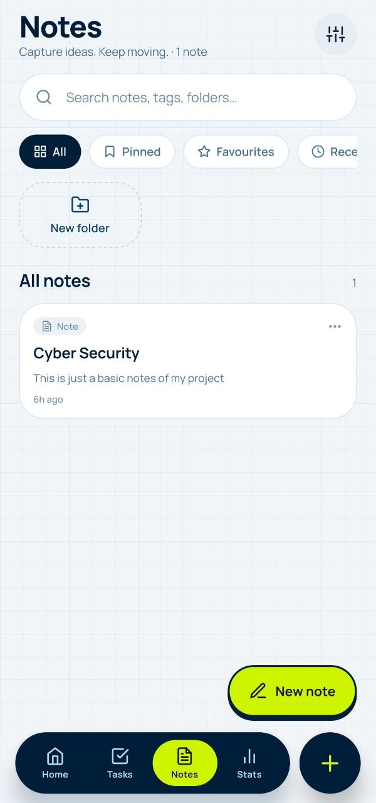 | 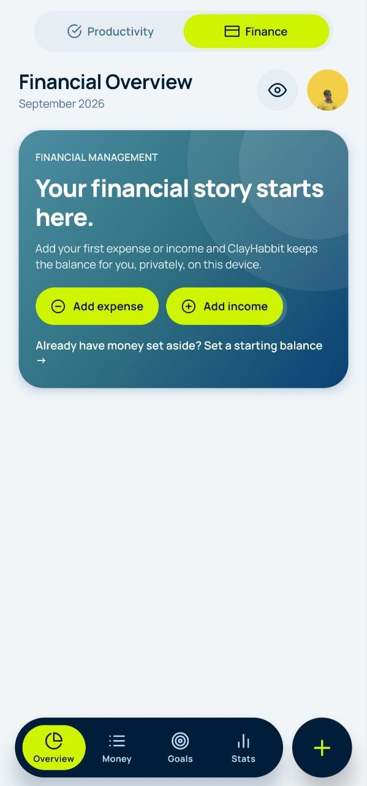 | 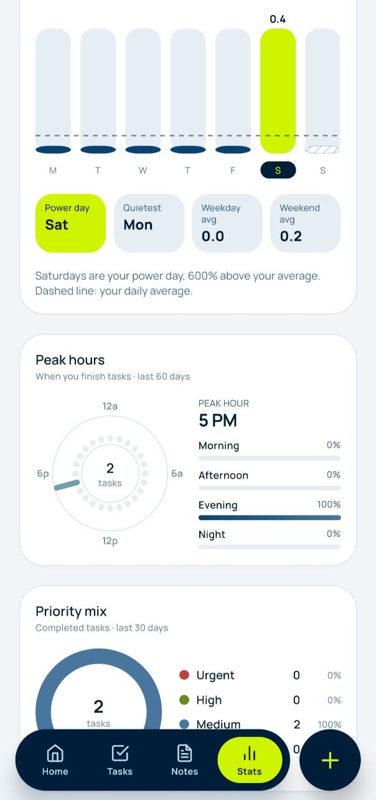 |

### Web

| Welcome | Sign in |
| :---: | :---: |
| 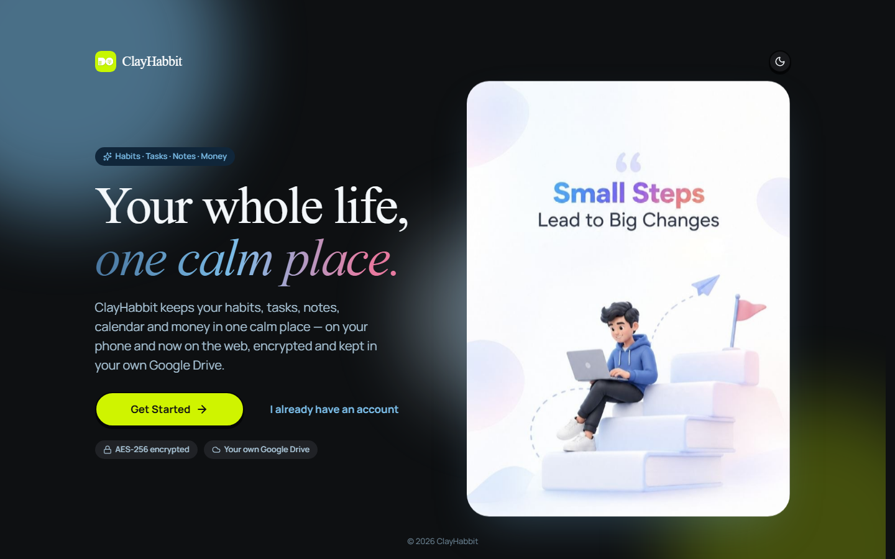 | 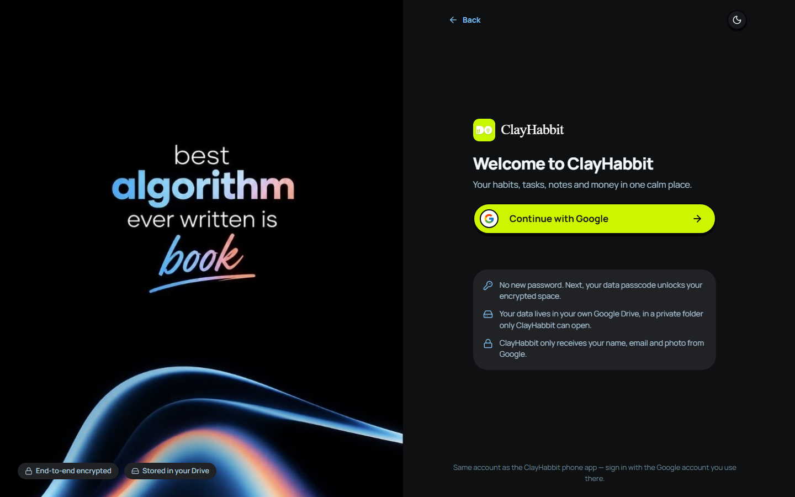 |

| Landing, light theme | Landing on a phone |
| :---: | :---: |
| 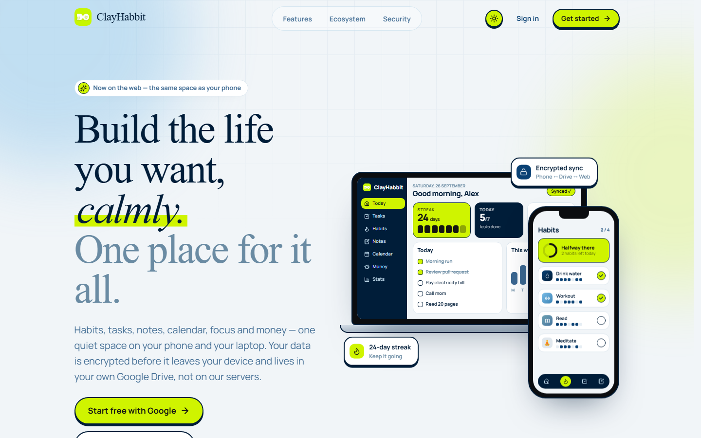 | 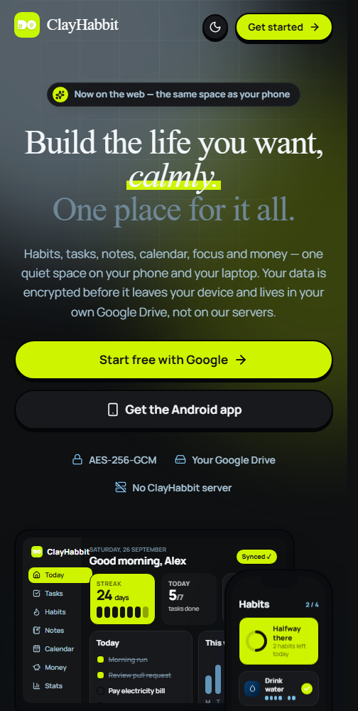 |

**Features**: the habit heatmap, tasks, notes, calendar, focus and money.

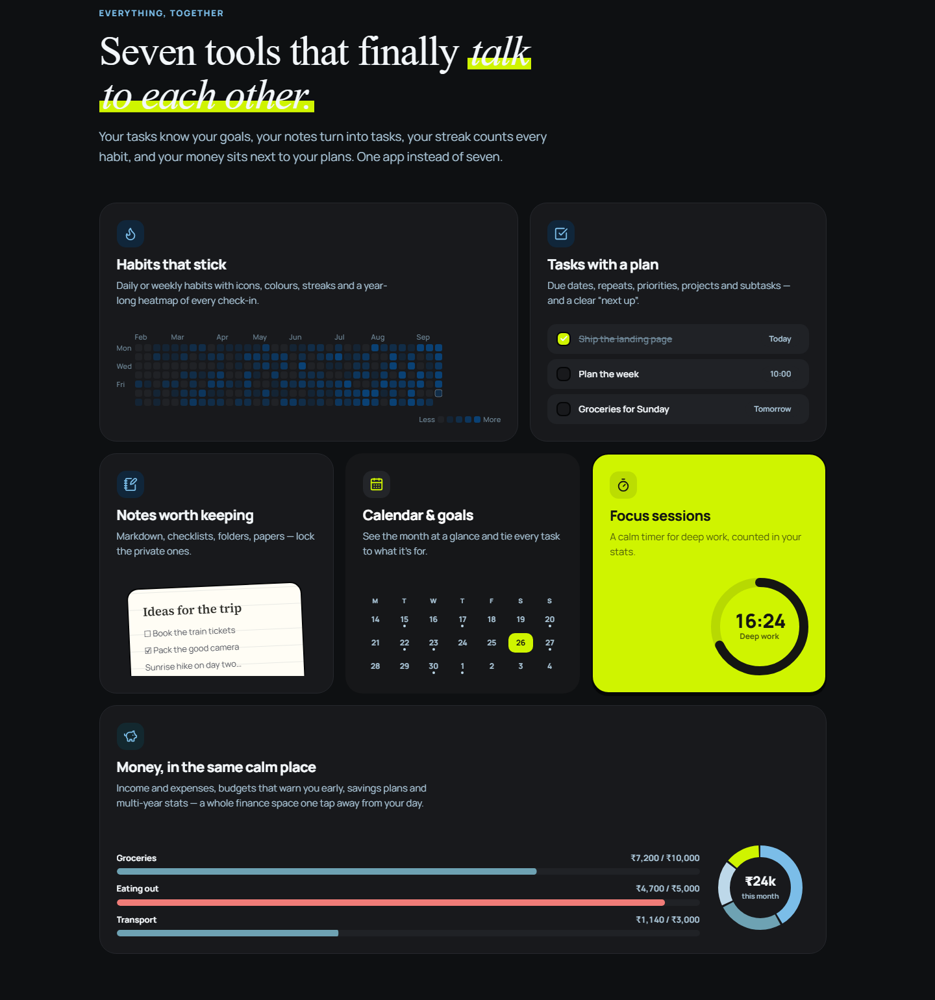

**Ecosystem:** phone ↔ your Google Drive ↔ web, sealed end to end.

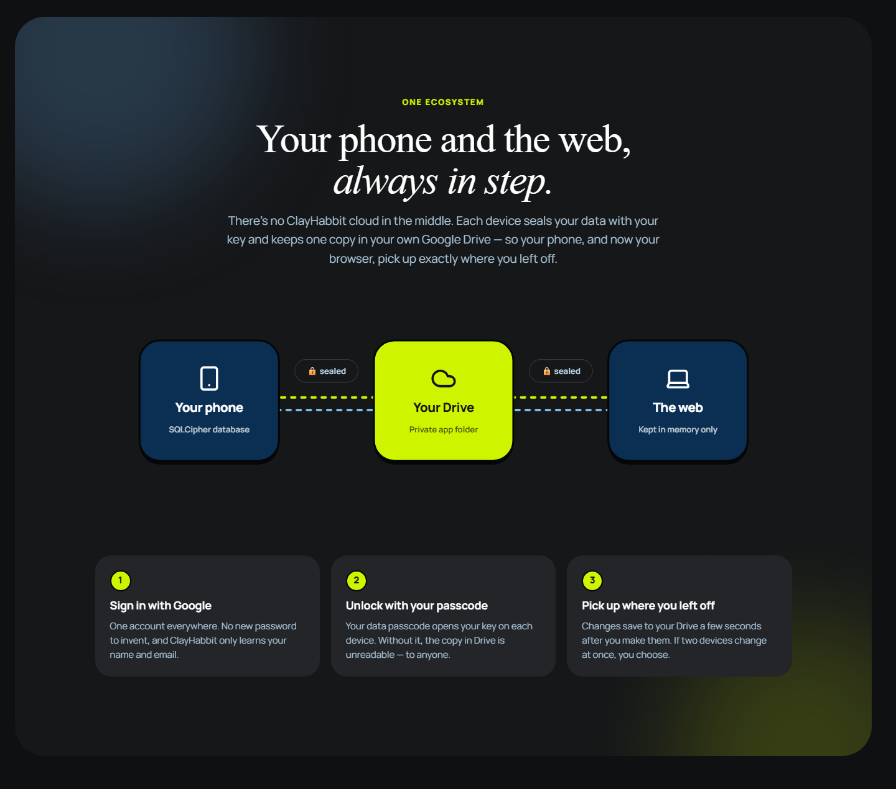

**Security:** what protects your data, and what ClayHabbit never does.

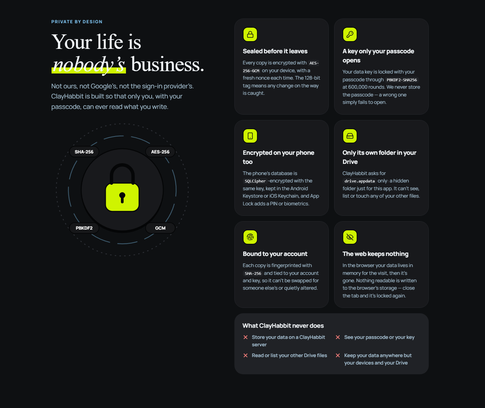

| Android download page | Call to action |
| :---: | :---: |
| 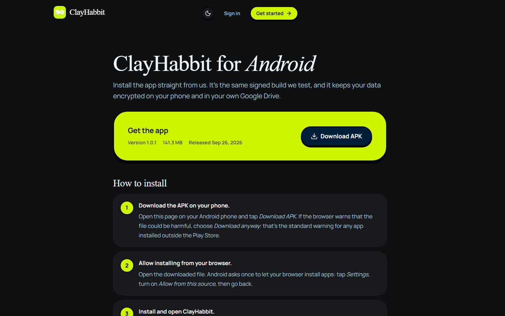 | 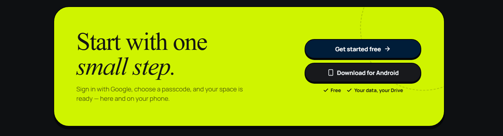 |

## What's inside

| | |
| --- | --- |
| **Today** | A dashboard with a streak card, focus card, today's target, week columns, next up, tasks, habits, your latest note, the year's activity heatmap, and money and focus at a glance |
| **Tasks** | Due dates and times, repeats, priorities, projects, goals, subtasks and reminders |
| **Habits** | Daily or weekly habits with icons, streaks, completion rates and heatmaps |
| **Notes** | Checklists, text colours, 8 fonts, tables and drawings, folders, papers, pins, favourites, locked notes and trash |
| **Calendar and goals** | A month view with events and due tasks; goals with progress from their linked tasks |
| **Focus** | A focus timer whose sessions count toward your stats |
| **Money** | Income and expenses, categories, budgets, savings plans and multi-year stats |
| **Stats** | Streaks, a yearly heatmap, weekly rhythm, time of day and priorities |
| **Sync** | Phone ↔ Google Drive ↔ web. Saves about a second after each change; the other side picks it up within seconds |

## Privacy and security

- **No ClayHabbit server.** Your data lives on your devices and, if you turn on Cloud, in your own Google Drive.
- **Encrypted before it leaves the device:** AES-256-GCM with a fresh nonce per save.
- **Your passcode is the key.** The data key is locked with your passcode (PBKDF2-SHA256, 600,000 rounds). The passcode is never stored or sent, so nobody else can open your data, the developer included.
- **Encrypted on the phone:** the database is SQLCipher, and its key is protected by the Android Keystore. App Lock adds a PIN or biometrics.
- **Only its own Drive folder:** the `drive.appdata` scope. ClayHabbit can't see any of your other files.
- **The web keeps nothing.** In the browser, your data lives in the tab's memory only and is gone when you close it.
- **No ads, analytics or tracking.**

## Built with

React Native and Expo (Android), React and Vite (web), SQLite with SQLCipher, and Google Drive for sync. Sign-in by Clerk with Google.

---

© 2026 [Cheekurthi-Vamsi](https://github.com/Cheekurthi-Vamsi). All rights reserved. The source code is private.
Found a problem? [Open an issue](https://github.com/Cheekurthi-Vamsi/ClayHabit/issues).

